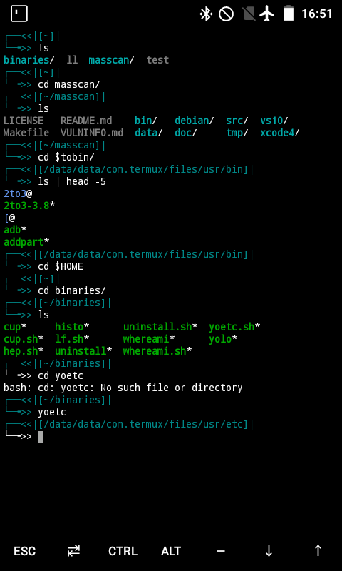
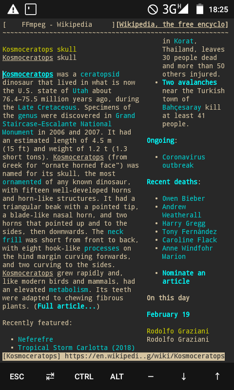
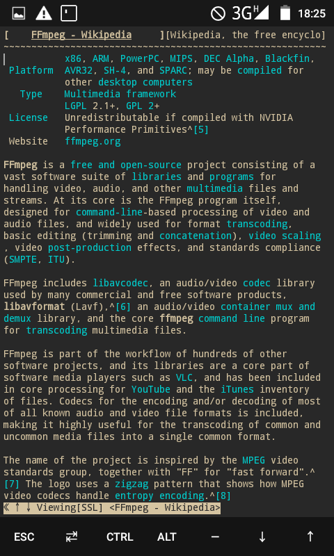
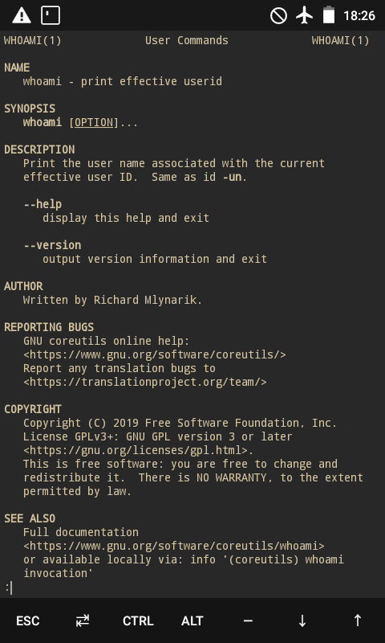
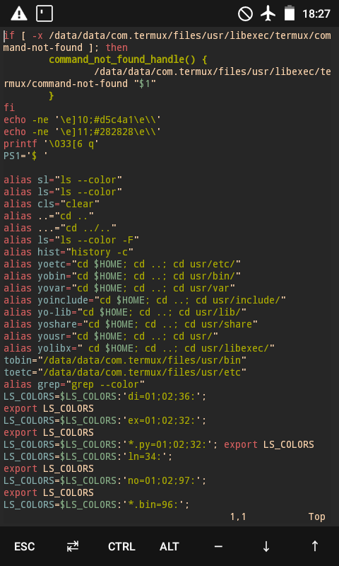
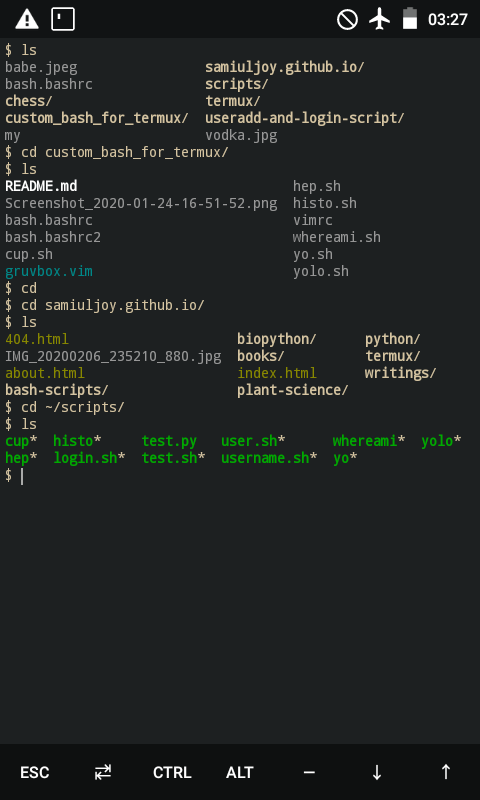
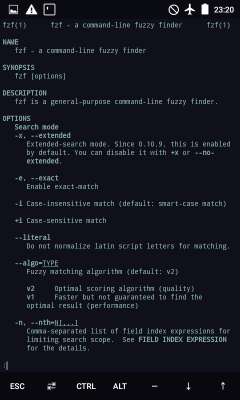
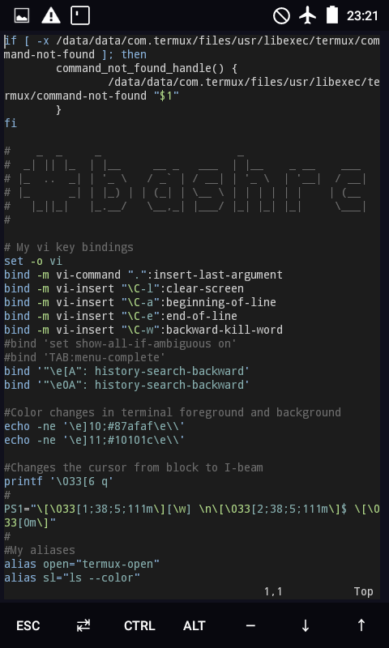
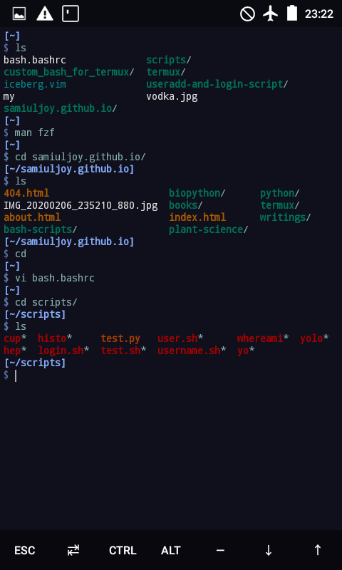

# A bit of cutomization for the termux Bourne Again Shell(BASH), and some easy binaries.sh

## bash.bashrc
This here is a little modification to the bash.bashrc file in the /usr/etc/bash.bashrc. Enjoy tweaking with these c:
Replace or copy the contents to your usr/etc/bash.bashrc 

## bash.bashrc2
This bash.bashrc2 is what my bash.bashrc looks like. It's inspired by gruvbox.vim theme from vim editor.Added couple of modifications like changing the default cursor to I-beam and tons of aliases. 

## bash.bashrc3(Night Owl theme)
Yet another update, custom prompts and perhaps a solarized version of my own, Inspired by iceberg.vim theme from vim.

## binaries.sh
These simple shell scripts might just make working a lot easier.
Copy these to usr/bin and dont forget to chmod u+x

## dotfiles
The dotfiles contain some config files for my tmux, vim and the key bindings I'm using for my bash atm. 

  ## Here's a screenshot to bash.bashrc

   

  ## Here's some screenshots to my bash terminal
   

   

   

   

   

  ## Night-owl theme

   
   
   
